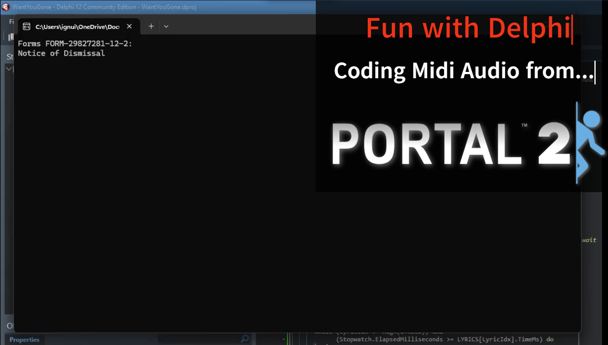

# Midi_Programming

A Delphi/Pascal implementation of the iconic "Want You Gone" credits from *Portal 2*. This project uses the Windows Multimedia API (`Winapi.MMSystem`) to orchestrate MIDI playback and synchronized terminal-style lyrics, mimicking the Aperture Science computer systems.



## Overview

This project demonstrates how to bridge the gap between MIDI data and console-based UI. By extracting note data and syncing it with a high-precision stopwatch, we've recreated the clinical, synthesized feel of GLaDOS's final farewell.

## The 4-Step Process

Coding can be fun! This project was built using a streamlined workflow:

1. **The Extractor:** Run the MIDI extractor program to convert a standard `.mid` file into a Pascal-compatible array of `TMidiEvent` records.

2. **The Player:** Load that generated array into the playback engine.

3. **Instrument Selection:** Swap standard MIDI patches for "Sci-Fi" leads. I found that **Program 80 (Square Wave)** provides the perfect 8-bit, synthesized vocal quality.

4. **Lyric Syncing:** Map the lyrics to an array with absolute millisecond timestamps to ensure the text rolls out in perfect time with the melody.

## Requirements

* **Compiler:** Embarcadero Delphi (or any compatible Pascal compiler).

* **OS:** Windows (requires `Winapi.MMSystem` for MIDI output).

* **MIDI Device:** The system "Microsoft GS Wavetable Synth" or any MIDI mapper.

## Usage

1. Compile `WantYouGone.dpr`.

2. Run the executable.

3. Observe **Notice of Dismissal** in the terminal.

```
Forms FORM-29827281-12-2:
Notice of Dismissal

 >> Well here we are again
 >> It's always such a pleasure...

```

**See? Coding can be fun. Now you try...**

